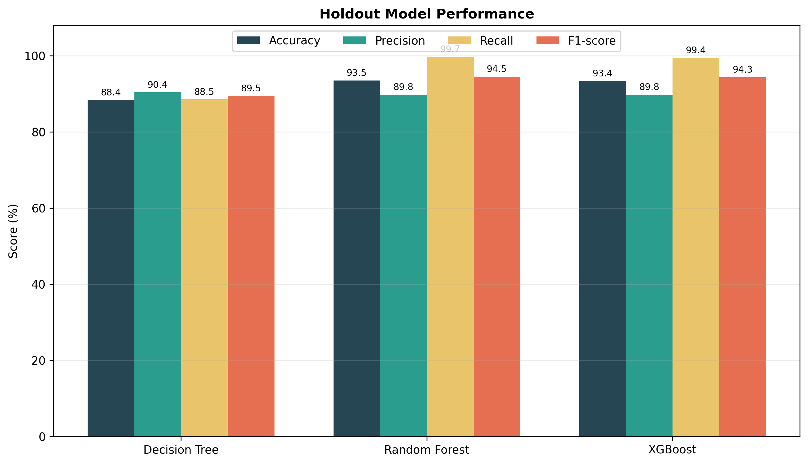
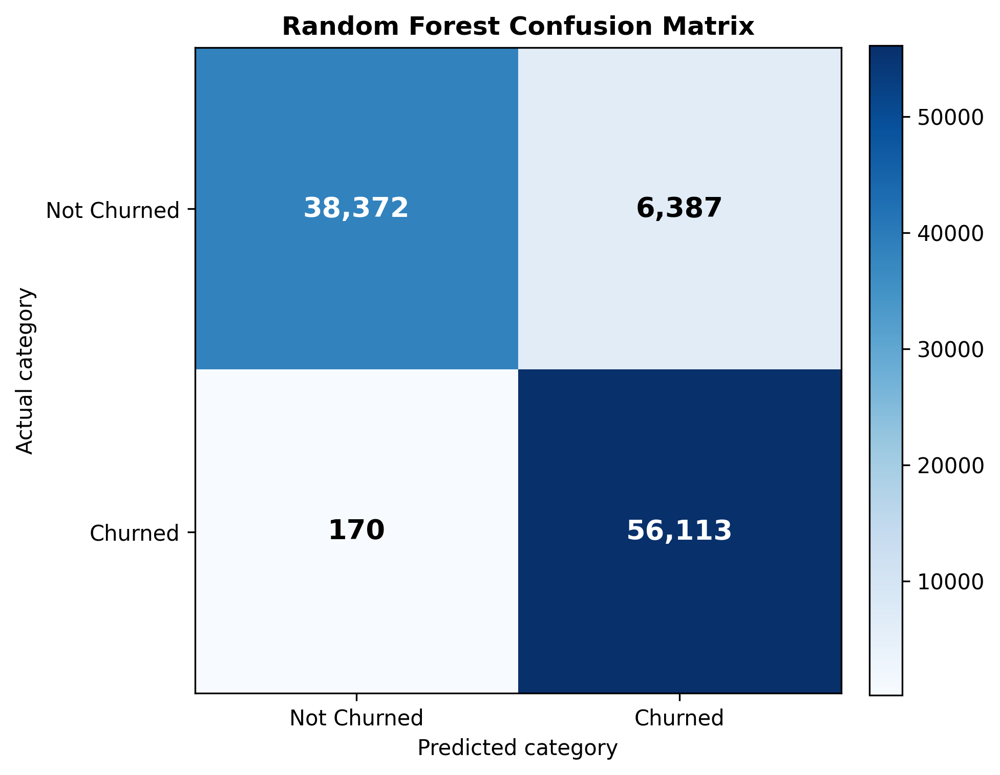

# Customer Churn Prediction — Phase 2

This repository contains the model-development phase of a customer churn
classification project using the public [Customer Churn Dataset by Muhammad
Shahid Azeem](https://www.kaggle.com/datasets/muhammadshahidazeem/customer-churn-dataset).

## Objective

The objective is to identify customers who are likely to discontinue their
subscription. The analysis uses demographic, behavioural, payment, support,
and contract variables to compare classification models and select a model
suitable for proactive retention campaigns.

## Dataset summary

| Characteristic | Value |
|---|---:|
| Combined observations | 505,207 |
| Clean observations | 505,206 |
| Churned customers | 280,492 (55.52%) |
| Non-churned customers | 224,714 (44.48%) |
| Training observations | 404,164 |
| Holdout observations | 101,042 |
| Model input features after encoding | 15 |

`CustomerID` is removed because it is an identifier rather than a meaningful
predictor. The three categorical variables—gender, subscription type, and
contract length—are one-hot encoded.

## Models compared

- Logistic Regression
- Gaussian Naive Bayes
- Multinomial Naive Bayes
- K-Nearest Neighbours
- Decision Tree
- Random Forest
- XGBoost

Random Forest is the final selected model. On the holdout data it achieved
approximately **0.94 accuracy, 0.90 precision, 1.00 recall, and 0.94 F1-score**.
Only 170 churners were missed among 56,283 actual churn cases.

## Repository structure

| Path | Purpose |
|---|---|
| `customer_churn_phase2.py` | End-to-end preprocessing, PCA exploration, model training, Random Forest tuning, evaluation, and export workflow |
| `notebooks/customer_retention_analysis.ipynb` | Analysis notebook containing EDA, model validation, holdout results, and sample predictions |
| `images/` | Report-ready EDA, PCA, model-comparison, and confusion-matrix figures |
| `results/` | Holdout metrics, confusion-matrix values, and the Random Forest classification report |
| `requirements.txt` | Python package requirements |

The dataset CSV files are not committed because they are publicly available on
Kaggle and can be downloaded by the script.

## Run in Google Colab

```python
!git clone https://github.com/ishan-srivastava/customer-churn-prediction.git
%cd customer-churn-prediction
!pip install -q -r requirements.txt
!python customer_churn_phase2.py
```

Generated files are saved in the `outputs/` directory.

## Workflow

1. Download and combine the supplied training and testing CSV files.
2. Remove the identifier and the single incomplete observation.
3. Examine target balance and multivariate churn patterns.
4. One-hot encode categorical variables and standardize variables where needed.
5. Use PCA as an exploratory two-dimensional view, while retaining the original
   features for model interpretability.
6. Train and compare linear, distance-based, probabilistic, tree, and boosting
   classifiers.
7. Tune Random Forest with recall-focused randomized search.
8. Evaluate using accuracy, precision, recall, F1-score, confusion matrices,
   ROC-AUC, and Precision–Recall curves.
9. Export report-ready plots, tables, model parameters, and the fitted model.

## Main findings

- Random Forest and XGBoost considerably outperform the simpler baselines.
- Random Forest provides the highest churn recall and the highest holdout
  accuracy among the final three models.
- Support calls, payment behaviour, usage frequency, total spend, tenure, and
  contract length provide actionable signals for customer-retention teams.
- The model is suitable as a prioritisation tool; retention actions should still
  be reviewed by business teams before contacting customers.

## Business interpretation

The results can be operationalised through a **Risk–Value–Action framework**:

| Customer segment | Recommended action |
|---|---|
| High risk, high value | Immediate personalised outreach and service recovery |
| High risk, low value | Automated reminders and low-cost retention offers |
| Low risk, high value | Loyalty benefits and proactive relationship management |
| Low risk, low value | Standard engagement and monitoring |

Repeated support calls should trigger an unresolved-case review, high payment
delay should trigger payment assistance, falling usage should trigger product
education, and suitable monthly customers can be offered longer-term contract
incentives. Expensive offers should be reserved for customers with both high
predicted risk and meaningful customer value.

## Report-ready results





## Limitations

The dataset is a public learning dataset and may contain cleaner patterns than
live operational data. Production use would require temporal validation,
probability calibration, drift monitoring, fairness checks, and measurement of
the financial return from retention interventions.
